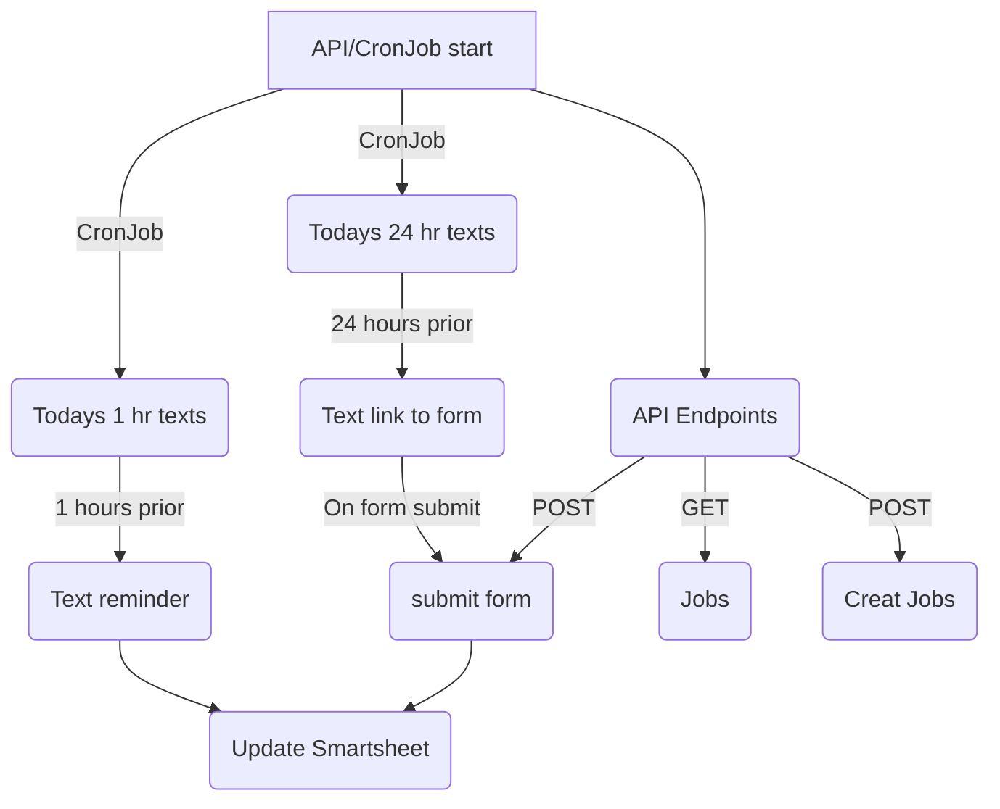

# Tech Checkin
## Summary
The Tech checkin schedules texts to be sent 24 hours prior to an appointment to confirm appointment details are correct in source sheet, schedules texts to be sent 1 hour prior to appoiintment and updates the source sheet with confirmations/corrections. the 24 hour text is a link to a form that autofills with details from the source sheet and gives the tech a chance to make any corrections.

## Platforms
* n8n: Hosts the form and sends the results back to the code
* Kubernetes: Hosts the api and job scheduling and n8n
* Concourse/Argo: CI/CD

## Code Flow

## Code Requirements
* apscheduler: Schedules Jobs
* fastapi: API Framework
* geopy: get Timezones
* loguru: Logging
* phonenumbers: Phone Number formatting
* pydantic: Class and Data Modeling
* python-dotenv: env reader
* pytz: handle timezones
* requests
* smartsheet-python-sdk
* uvicorn: serve fast api